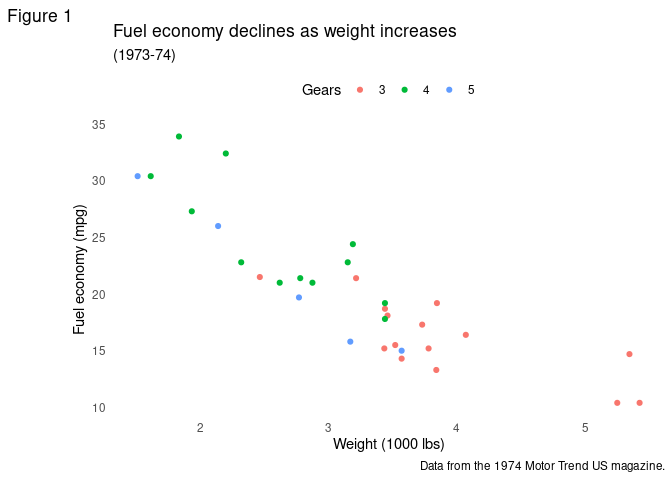

<!-- README.md is generated from README.Rmd. Please edit that file -->

# hare

<!-- badges: start -->
<!-- badges: end -->

This package stores my custom themes and functions for personal use.

## Installation

You can install hare like so:

``` r
devtools::install_github("jamesphare/hare")
```

## Usage

Load the library:

``` r
library(hare)
```

Currently the only function in this package is `theme_james`, a slightly
more minimal version of `theme_minimal`.

## Example

``` r
mtcars2 <- within(mtcars, {
  vs <- factor(vs, labels = c("V-shaped", "Straight"))
  am <- factor(am, labels = c("Automatic", "Manual"))
  cyl  <- factor(cyl)
  gear <- factor(gear)
})

theme_set(theme_james)

ggplot(mtcars2) +
  geom_point(aes(x = wt, y = mpg, colour = gear)) +
  labs(title = "Fuel economy declines as weight increases",
       subtitle = "(1973-74)",
       caption = "Data from the 1974 Motor Trend US magazine.",
       tag = "Figure 1",
       x = "Weight (1000 lbs)",
       y = "Fuel economy (mpg)",
       colour = "Gears")
```


