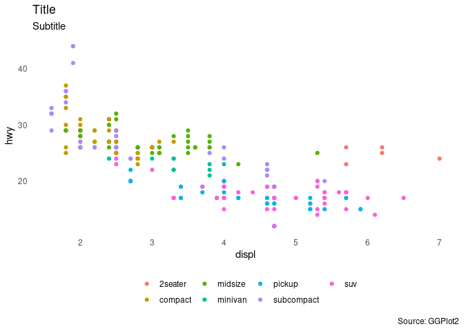

<!-- README.md is generated from README.Rmd. Please edit that file -->

# hare

<!-- badges: start -->
<!-- badges: end -->

This package stores my custom themes and functions for personal use.
Currently the only function in this package is `theme_james`, a slightly
more minimal version of `theme_minimal`.

## Installation

You can install `hare` like so:

``` r
devtools::install_github("jamesphare/hare")
```

## Usage

Load the library:

``` r
library(hare)
```

`theme_james()` may be added to a GGPlot object or set generally using
`theme_set()`.

## Example

``` r
theme_set(theme_james())

ggplot(mpg, aes(displ, hwy, colour = class)) +
  geom_point() +
  labs(title = "Title",
       subtitle = "Subtitle",
       caption = "Source: GGPlot2")
```


